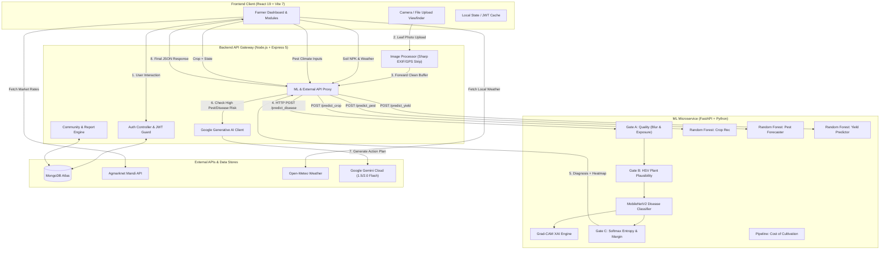
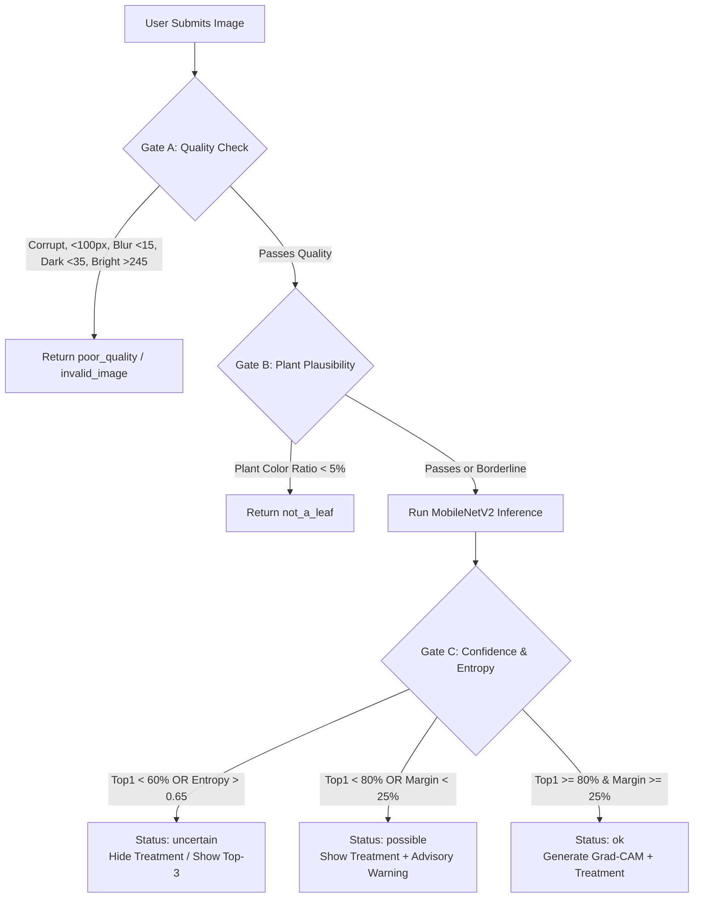

# 🌾 FarmGuide 2.0 — Codebase Architecture, Tech Stack & Machine Learning Documentation

---

## 📑 Table of Contents
1. [Executive System Overview](#1-executive-system-overview)
2. [Complete Technology Stack](#2-complete-technology-stack)
   - [2.1 Frontend Client (React + Vite)](#21-frontend-client-react--vite)
   - [2.2 Backend Gateway (Node.js + Express)](#22-backend-gateway-nodejs--express)
   - [2.3 Machine Learning Microservice (Python + FastAPI)](#23-machine-learning-microservice-python--fastapi)
   - [2.4 Database & Storage Layer](#24-database--storage-layer)
   - [2.5 External Services & Government APIs](#25-external-services--government-apis)
3. [End-to-End System Architecture & Data Flow](#3-end-to-end-system-architecture--data-flow)
4. [Deep Dive: Machine Learning & AI Models](#4-deep-dive-machine-learning--ai-models)
   - [4.1 Plant Leaf Disease Detection (MobileNetV2 CNN)](#41-plant-leaf-disease-detection-mobilenetv2-cnn)
   - [4.2 Explainable AI (Grad-CAM Heatmap Visualization)](#42-explainable-ai-grad-cam-heatmap-visualization)
   - [4.3 Four-Gate Input Guard & OOD Robustness Pipeline](#43-four-gate-input-guard--ood-robustness-pipeline)
   - [4.4 Crop Recommendation Model (Random Forest Classifier)](#44-crop-recommendation-model-random-forest-classifier)
   - [4.5 Pest & Outbreak Prediction System (Dual-Engine Classifier & Regressor)](#45-pest--outbreak-prediction-system-dual-engine-classifier--regressor)
   - [4.6 Crop Yield Estimation Model (Random Forest Regressor)](#46-crop-yield-estimation-model-random-forest-regressor)
   - [4.7 Cost of Cultivation Predictor (Pipeline + OneHot + Random Forest)](#47-cost-of-cultivation-predictor-pipeline--onehot--random-forest)
   - [4.8 Generative AI Conversational Assistant (Google Gemini LLM Cascade)](#48-generative-ai-conversational-assistant-google-gemini-llm-cascade)
5. [Data Sources & External API Integrations](#5-data-sources--external-api-integrations)
6. [Security, Privacy & Moderation System](#6-security-privacy--moderation-system)
7. [Repository File Map](#7-repository-file-map)
8. [Local Setup & Deployment Instructions](#8-local-setup--deployment-instructions)

---

## 1. Executive System Overview

**FarmGuide 2.0** is an intelligent precision agriculture and advisory platform designed to bridge the gap between advanced predictive data science and rural farming communities. The system combines:
1. **Computer Vision (Deep Learning)**: Automated leaf disease diagnosis with visual interpretability (Grad-CAM).
2. **Tabular Predictive Modeling**: Micro-climate-driven crop recommendation, pest emergence forecasting, yield estimation, and cultivation expenditure prediction.
3. **Generative Agronomical AI**: Multi-turn bilingual conversational assistance powered by Google Gemini.
4. **Real-time Live Integrations**: Wholesale Mandi (APMC) prices, hyper-local meteorological forecasts, and government subsidy matchmaking.
5. **Community Collaboration**: Geolocation-sanitized social feed for peer-to-peer diagnostic validation.

The platform follows a **decoupled 3-tier microservices architecture**:
- **Client (Frontend)**: React 19 Single Page Application (SPA) bundled with Vite 7.
- **API Gateway (Backend)**: Node.js & Express 5 managing business logic, user auth, rate limits, community data, and ML proxy orchestration.
- **Intelligence Engine (ML Microservice)**: Python FastAPI application hosting serialized Scikit-Learn models, Keras deep neural networks, and OpenCV pre-validation gates.

---

## 2. Complete Technology Stack

### 2.1 Frontend Client (React + Vite)
Located in [`client/`](file:///c:/Users/Prashant/OneDrive/Documents/Desktop/Projects/Farmguide/farmGuide/client)

| Technology / Library | Version | Role & Description |
| :--- | :--- | :--- |
| **React** | `^19.2.0` | Core UI library utilizing functional components, custom hooks, and concurrent rendering. |
| **Vite** | `^7.3.1` | Next-generation frontend build tool offering instant HMR (Hot Module Replacement) and optimized Rollup bundling. |
| **Tailwind CSS** | `^4.2.1` | Modern utility-first CSS engine powering glassmorphism themes, adaptive dark/light palettes, and responsive layouts. |
| **Framer Motion** | `^12.34.3` | Production-ready animation engine for page transitions, floating diagnostic cards, dynamic accordion panels, and micro-interactions. |
| **Recharts** | `^3.7.0` | SVG-based charting library used for 7-day Mandi modal price volatility, risk score gauges, and weather trend lines. |
| **Lucide React** | `^0.575.0` | Lightweight SVG icon library covering weather states, navigation, diagnostic badges, and agronomical tools. |
| **React Router DOM** | `^7.13.1` | Client-side routing with guarded private routes (`/dashboard`, `/profile`, `/community`, etc.). |
| **Axios** | `^1.13.5` | Promise-based HTTP client with interceptors for attaching JWT bearer tokens. |
| **@vitejs/plugin-basic-ssl** | `^2.3.0` | Generates self-signed SSL certificates for mobile browser testing over local Wi-Fi to unlock camera access (`getUserMedia`). |
| **Native i18n System** | Internal | Custom localized dictionary supporting **English (`en`)**, **Hindi (`hi`)**, and **Marathi (`mr`)** ([`translations.js`](file:///c:/Users/Prashant/OneDrive/Documents/Desktop/Projects/Farmguide/farmGuide/client/src/config/translations.js)). |

---

### 2.2 Backend Gateway (Node.js + Express)
Located in [`server/`](file:///c:/Users/Prashant/OneDrive/Documents/Desktop/Projects/Farmguide/farmGuide/server)

| Technology / Library | Version | Role & Description |
| :--- | :--- | :--- |
| **Node.js** | `>=18.0.0` | Asynchronous event-driven server runtime environment. |
| **Express** | `^5.2.1` | Minimalist web application framework managing RESTful API endpoints and middleware pipelines. |
| **Mongoose** | `^9.2.3` | Object Data Modeling (ODM) library for MongoDB providing schema validation, indexes, and relationship modeling. |
| **jsonwebtoken (JWT)** | `^9.0.3` | Cryptographic stateless token creation and validation for secure user authentication. |
| **bcrypt** | `^6.0.0` | Adaptive salted password hashing ensuring secure credential storage. |
| **Multer** | `^2.1.0` | Multipart/form-data middleware handling direct image uploads in memory buffer before forwarding to ML or disk. |
| **Sharp** | `^0.35.5` | High-performance image processing: strips sensitive EXIF/GPS coordinates to safeguard farm locations, resizes community photos, and re-encodes to web-optimized JPEG. |
| **express-rate-limit** | `^8.7.0` | Middleware enforcing rate limits on community post submissions, comment creation, and authentication routes to prevent abuse. |
| **@google/generative-ai** | `^0.24.1` | Official SDK for Google Gemini models; powers the conversational Agri-Bot and automatic agronomic action plan synthesis. |
| **Cloudinary** | `^2.11.0` | Cloud image hosting provider (pluggable via `STORAGE_DRIVER=cloudinary`). |

---

### 2.3 Machine Learning Microservice (Python + FastAPI)
Located in [`ml/`](file:///c:/Users/Prashant/OneDrive/Documents/Desktop/Projects/Farmguide/farmGuide/ml)

| Technology / Library | Role & Description |
| :--- | :--- |
| **FastAPI** | High-performance asynchronous web framework for serving ML inference endpoints with automated OpenAPI schemas and Pydantic validation. |
| **Uvicorn** | Lightning-fast ASGI web server implementation for Python. |
| **TensorFlow / Keras** | Deep learning framework used for loading, preprocessing, and executing the MobileNetV2 leaf disease classifier. |
| **Scikit-Learn** | Tabular machine learning suite providing `RandomForestClassifier`, `RandomForestRegressor`, `ColumnTransformer`, `OneHotEncoder`, `LabelEncoder`, and `Pipeline`. |
| **OpenCV (opencv-python-headless)** | Computer vision library for image decoding, Laplacian variance blur computation, HSV color space segmentation, and Grad-CAM colormap generation. |
| **Pandas & NumPy** | High-performance numerical computation, data frame slicing, vectorization, and matrix manipulation. |
| **Pillow (PIL)** | Image parsing, resizing, and color-channel conversion. |

---

### 2.4 Database & Storage Layer

- **MongoDB (Local / Atlas)**: Document database storing:
  - `User`: Farmer credentials, location hierarchy (State, District), registered crops, preferred language.
  - `Post`: Community diagnostic inquiries, image arrays, author references, upvotes, helpful solutions.
  - `Comment`: Community responses, author tags, and helpful solution flags.
  - `Report`: Moderation flags submitted against inappropriate community content.
  - `SoilData`: Logged N-P-K, pH, and moisture records associated with farmer recommendations.
  - `Scheme`: Curated database of state and central agricultural subsidy schemes.
- **Storage Subsystem**:
  - `local`: Serves sanitized user images from `server/uploads/community/` with static routing.
  - `cloudinary`: Direct cloud bucket integration for production cloud deployments.

---

### 2.5 External Services & Government APIs

- **Agmarknet (Directorate of Marketing & Inspection - DMI)**: Live wholesale commodity market prices (modal, min, max in ₹/quintal) across Indian mandis via Render proxy (`mandi-api.onrender.com`).
- **Open-Meteo Weather API**: Global numerical weather prediction models (ECMWF, NOAA GFS, DWD ICON) for hyper-local temperature, precipitation probability, humidity, and 7-day outlooks.
- **OpenStreetMap Nominatim**: Reverse geocoding latitude and longitude coordinates into administrative districts and states without proprietary API keys.
- **Google Gemini API**: Large Language Model infrastructure for precision agricultural dialogue and emergency pest countermeasures.

---

## 3. End-to-End System Architecture & Data Flow



---

## 4. Deep Dive: Machine Learning & AI Models

### 4.1 Plant Leaf Disease Detection (MobileNetV2 CNN)

#### 📌 Overview
- **Model File**: [`ml/models/disease_model.h5`](file:///c:/Users/Prashant/OneDrive/Documents/Desktop/Projects/Farmguide/farmGuide/ml/models/disease_model.h5)
- **Class Labels**: [`ml/models/disease_classes.json`](file:///c:/Users/Prashant/OneDrive/Documents/Desktop/Projects/Farmguide/farmGuide/ml/models/disease_classes.json) (38 categories)
- **Dataset**: PlantVillage Dataset (over 54,000 images covering 14 crops across 38 healthy and diseased states).
- **Architecture**: Deep Convolutional Neural Network based on **MobileNetV2** using **Transfer Learning** from ImageNet.

#### 🧠 What is MobileNetV2?
MobileNetV2 is an efficient convolutional neural network architecture specifically engineered by Google for mobile and edge computing devices. Traditional convolutional layers apply dense filters across all input channels simultaneously, which is computationally expensive ($O(D_K \cdot D_K \cdot M \cdot N \cdot D_F \cdot D_F)$). MobileNetV2 replaces this with:
1. **Depthwise Separable Convolutions**: Splits standard convolution into two stages:
   - *Depthwise Convolution*: Applies a single $3 \times 3$ convolutional filter per input channel to capture spatial features independently.
   - *Pointwise Convolution*: Applies a $1 \times 1$ convolution to project the channel outputs into a new feature space. This reduces computational parameters and floating-point operations (FLOPs) by **8 to 9 times** with negligible accuracy loss.
2. **Inverted Residual Blocks**: While standard ResNet blocks compress channels then expand them, MobileNetV2 expands channels to a higher-dimensional space using $1 \times 1$ convolution, performs depthwise convolution, and then projects back to a lower-dimensional representation.
3. **Linear Bottlenecks**: Avoids non-linear activations (like ReLU) in the narrow bottleneck layers to prevent catastrophic destruction of manifold information.

#### 🔬 How It Works in FarmGuide:
1. **Input Preprocessing**: The uploaded image is decoded, converted to RGB, resized to $(224 \times 224 \times 3)$, and normalized to pixel values in $[0.0, 1.0]$.
2. **Feature Extraction**: The tensor passes through the frozen pre-trained MobileNetV2 convolutional backbone.
3. **Classification Head**:
   - `GlobalAveragePooling2D()`: Collapses spatial dimensions $(7 \times 7 \times 1280)$ into a flat 1280-dimensional feature vector.
   - `Dense(128, activation='relu')`: Fully connected projection capturing disease patterns.
   - `Dropout(0.2)`: Regularization preventing overfitting.
   - `Dense(38, activation='softmax')`: Outputs normalized probability distribution vector $\mathbf{p} = [p_1, p_2, \dots, p_{38}]$ where $\sum p_i = 1$.
4. **Curated Agronomic Grounding**: The top predicted label is mapped against [`server/data/disease_knowledge.json`](file:///c:/Users/Prashant/OneDrive/Documents/Desktop/Projects/Farmguide/farmGuide/server/data/disease_knowledge.json) to return symptom profiles, cultural controls, biological solutions, chemical treatments, and regulatory safety notices.

---

### 4.2 Explainable AI (Grad-CAM Heatmap Visualization)

#### 📌 Overview
- **Implementation**: [`ml/gradcam.py`](file:///c:/Users/Prashant/OneDrive/Documents/Desktop/Projects/Farmguide/farmGuide/ml/gradcam.py)
- **Role**: Overcomes the "black-box" dilemma of deep neural networks by providing farmers with a visual visual heatmap highlighting the exact leaf lesions responsible for the classification.

#### 🔬 Mathematical Foundation & Execution
Grad-CAM (Gradient-weighted Class Activation Mapping) uses the gradients of any target concept flowing into the final convolutional layer to produce a coarse localization map highlighting the important regions in the image:

1. **Locate Target Layer**: The engine traverses the model layers backwards via `find_last_conv_layer()` to identify the final convolutional layer (typically `Conv_1` in MobileNetV2).
2. **Compute Gradients**: Using TensorFlow's `tf.GradientTape()`, the system calculates the gradient of the winning class score $y^c$ with respect to feature activation maps $A^k$ of the convolutional layer:
   $$\frac{\partial y^c}{\partial A^k}$$
3. **Global Average Pooling of Gradients**: Computes the neuron importance weights $\alpha_k^c$:
   $$\alpha_k^c = \frac{1}{Z} \sum_{i} \sum_{j} \frac{\partial y^c}{\partial A_{i,j}^k}$$
4. **Weighted Linear Combination & ReLU**:
   $$L_{\text{Grad-CAM}}^c = \text{ReLU}\left(\sum_{k} \alpha_k^c A^k\right)$$
   The $\text{ReLU}$ ensures that only features that have a positive influence on the target class are retained.
5. **Colormap Overlay**: The 2D activation matrix is normalized between $[0, 1]$, upsampled to $(224 \times 224)$, mapped through OpenCV's `COLORMAP_JET`, and blended with the original leaf photo at an opacity of $\alpha = 0.40$. The result is returned as a base64-encoded JPEG.

---

### 4.3 Four-Gate Input Guard & OOD Robustness Pipeline

#### 📌 Overview
- **Implementation**: [`ml/input_guard.py`](file:///c:/Users/Prashant/OneDrive/Documents/Desktop/Projects/Farmguide/farmGuide/ml/input_guard.py)
- **Configuration**: [`ml/guard_config.py`](file:///c:/Users/Prashant/OneDrive/Documents/Desktop/Projects/Farmguide/farmGuide/ml/guard_config.py)
- **Role**: Protects the deep learning model from Out-of-Distribution (OOD) images (e.g. selfies, furniture, animal photos, corrupted files, extremely blurry/dark captures) and assigns calibrated confidence statuses (`ok`, `possible`, `uncertain`, `poor_quality`, `not_a_leaf`).



#### 🛡️ Detailed Gate Mechanics:
1. **Gate A — Image Quality & Exposure**:
   - *Resolution*: Minimum 100px on the shorter side.
   - *Blur Detection*: Uses **Laplacian Variance** ($\sigma^2 = \text{Var}(\nabla^2 I)$). The image is downscaled to a standard width of 400px, converted to greyscale, and convolved with the Laplacian kernel. If $\sigma^2 < 15.0$, the image is flagged as blurred.
   - *Exposure*: Calculates mean greyscale luminance. Images with brightness $< 35$ (underexposed) or $> 245$ (washed out) are safely rejected.
2. **Gate B — HSV Plant Tissue Plausibility**:
   - Converts image to HSV (Hue, Saturation, Value) color space.
   - Identifies plant tissue masks across green ($H \in [25, 95]$), yellow ($H \in [15, 35]$), brown/rust ($H \in [0, 20]$), and dark necrosis patches ($V \in [20, 80]$).
   - Filters out background noise (low saturation $S < 25$) and human skin tones ($H \in [0, 25], S \in [40, 180], V \in [80, 255]$).
   - If plant pixel ratio $< 5\%$, the request is terminated with `not_a_leaf`.
3. **Gate C — Softmax Confidence, Margin & Entropy**:
   - *Top-1 Confidence*: Highest predicted probability $p_{(1)}$.
   - *Prediction Margin*: Difference between top-1 and top-2 probabilities:
     $$\Delta = p_{(1)} - p_{(2)}$$
   - *Normalized Shannon Entropy*: Measures prediction dispersion across all $K=38$ classes:
     $$H_{\text{norm}} = \frac{-\sum_{i=1}^K p_i \ln(p_i + \epsilon)}{\ln(K)}$$
   - If $H_{\text{norm}} > 0.65$ or $p_{(1)} < 0.60$, the system returns `uncertain` and suppresses prescriptive chemical recommendations to prevent dangerous misapplication.
4. **Gate D — Zero-Shot Vision-Language Filter (CLIP Stub)**:
   - Configurable hook for deploying OpenAI CLIP (`clip-vit-base-patch32`) for zero-shot text-image similarity prompts (*"a photo of a plant leaf"* vs *"a photo of something else"*).

---

### 4.4 Crop Recommendation Model (Random Forest Classifier)

#### 📌 Overview
- **Model File**: [`ml/models/crop_model.pkl`](file:///c:/Users/Prashant/OneDrive/Documents/Desktop/Projects/Farmguide/farmGuide/ml/models/crop_model.pkl)
- **Training Script**: [`ml/train_model.py`](file:///c:/Users/Prashant/OneDrive/Documents/Desktop/Projects/Farmguide/farmGuide/ml/train_model.py)
- **Algorithm**: `RandomForestClassifier(n_estimators=20, random_state=42)`
- **Input Features (7 dimensions)**:
  1. `N`: Soil Nitrogen content (ratio)
  2. `P`: Soil Phosphorus content (ratio)
  3. `K`: Soil Potassium content (ratio)
  4. `temperature`: Ambient temperature in °C
  5. `humidity`: Relative humidity in %
  6. `ph`: Soil pH level (0.0 to 14.0)
  7. `rainfall`: Seasonal precipitation in mm
- **Target Output**: Optimal crop class (e.g., Rice, Maize, Wheat, Chickpea, Cotton, Coffee, Apple, etc.)

#### 🧠 What is a Random Forest Classifier?
Random Forest is an ensemble meta-estimator that fits multiple decision trees on various sub-samples of the dataset and uses averaging/majority voting to improve predictive accuracy and control over-fitting:
1. **Bootstrap Aggregating (Bagging)**: Each tree in the forest is trained on an independently sampled subset of the training data (drawn with replacement).
2. **Random Subspace Method**: At each split candidate node, only a random subset of features ($\sqrt{N_{\text{features}}}$) is considered. This de-correlates individual trees so an error in one tree does not compromise the ensemble.
3. **Splitting Metric**: Measures Gini Impurity:
   $$I_G(p) = 1 - \sum_{i=1}^C p_i^2$$
   The split minimizing $I_G$ is chosen.
4. **Inference**: Returns the top 3 ranked crops sorted by ensemble class probabilities (`predict_proba()`), allowing farmers to choose alternatives based on local seed availability.

---

### 4.5 Pest & Outbreak Prediction System (Dual-Engine Classifier & Regressor)

#### 📌 Overview
- **Model Files**:
  - Classifier: [`ml/models/pest_classifier.pkl`](file:///c:/Users/Prashant/OneDrive/Documents/Desktop/Projects/Farmguide/farmGuide/ml/models/pest_classifier.pkl)
  - Regressor: [`ml/models/pest_regressor.pkl`](file:///c:/Users/Prashant/OneDrive/Documents/Desktop/Projects/Farmguide/farmGuide/ml/models/pest_regressor.pkl)
  - Encoders: [`ml/models/pest_crop_encoder.pkl`](file:///c:/Users/Prashant/OneDrive/Documents/Desktop/Projects/Farmguide/farmGuide/ml/models/pest_crop_encoder.pkl), [`ml/models/pest_location_encoder.pkl`](file:///c:/Users/Prashant/OneDrive/Documents/Desktop/Projects/Farmguide/farmGuide/ml/models/pest_location_encoder.pkl)
- **Training Script**: [`ml/train_pest_model.py`](file:///c:/Users/Prashant/OneDrive/Documents/Desktop/Projects/Farmguide/farmGuide/ml/train_pest_model.py)
- **Input Features (9 dimensions)**:
  1. `Temperature_C`
  2. `Humidity_percent`
  3. `Rainfall_mm`
  4. `Soil_pH`
  5. `Nitrogen_N`
  6. `Phosphorus_P`
  7. `Potassium_K`
  8. `Crop_Type_Encoded` (Label-encoded categorical)
  9. `Location_Encoded` (Label-encoded categorical)

#### 🔬 Dual-Engine Execution Pipeline:
1. **Engine 1 — Categorical Pest Identification**:
   - Algorithm: `RandomForestClassifier(n_estimators=100)`
   - Predicts the specific pest or pathogen identity (e.g., Aphids, Armyworm, Stem Borer, Whitefly, Rust).
2. **Engine 2 — Outbreak Severity / Probability Regression**:
   - Algorithm: `RandomForestRegressor(n_estimators=100)`
   - Predicts continuous outbreak likelihood $P \in [0.0, 100.0]\%$.
   - Maps score into actionable alerts:
     - $P \le 40\%$: **LOW RISK** (Normal field observation).
     - $40\% < P \le 70\%$: **MEDIUM RISK** (Elevated vigilance, prep bio-pesticides).
     - $P > 70\%$: **HIGH RISK** (Immediate preventative countermeasure required).
3. **Automated AI Countermeasure Synthesis**:
   - When risk exceeds $50\%$, the Node.js backend intercepts the prediction and prompts Google Gemini to formulate an emergency, 2-sentence agronomic action plan tailored to that specific crop and pest.

---

### 4.6 Crop Yield Estimation Model (Random Forest Regressor)

#### 📌 Overview
- **Model Files**: [`ml/models/yield_model.pkl`](file:///c:/Users/Prashant/OneDrive/Documents/Desktop/Projects/Farmguide/farmGuide/ml/models/yield_model.pkl), `area_encoder.pkl`, `item_encoder.pkl`
- **Training Script**: [`ml/train_yield_model.py`](file:///c:/Users/Prashant/OneDrive/Documents/Desktop/Projects/Farmguide/farmGuide/ml/train_yield_model.py)
- **Dataset**: FAO (Food and Agriculture Organization) crop yield and pesticide consumption records.
- **Input Features**:
  1. `Area_encoded` (State / Geographic region)
  2. `Item_encoded` (Crop name)
  3. `average_rain_fall_mm_per_year`
  4. `pesticides_tonnes`
  5. `avg_temp`
- **Target**: `hg/ha_yield` (Hectograms per hectare yield, where $1 \text{ hg/ha} = 0.1 \text{ kg/ha}$).

---

### 4.7 Cost of Cultivation Predictor (Pipeline + OneHot + Random Forest)

#### 📌 Overview
- **Model File**: `ml/models/cost_model.pkl`
- **Training Script**: [`ml/train_cost_model.py`](file:///c:/Users/Prashant/OneDrive/Documents/Desktop/Projects/Farmguide/farmGuide/ml/train_cost_model.py)
- **Dataset**: Government of India Ministry of Agriculture Cost of Cultivation statistics.
- **Pipeline Architecture**:
  ```python
  preprocessor = ColumnTransformer(transformers=[
      ('cat', OneHotEncoder(handle_unknown='ignore'), ['Crop', 'State'])
  ])
  model = Pipeline(steps=[
      ('preprocessor', preprocessor),
      ('regressor', RandomForestRegressor(n_estimators=100, random_state=42))
  ])
  ```
- **Target**: Comprehensive Cost of Cultivation C2 (₹/Hectare), incorporating leased land rent, family labor valuation, interest on working capital, seed, fertilizer, and irrigation expenditures.
- **Resilience**: `handle_unknown='ignore'` guarantees the server will not throw runtime exceptions if a farmer enters an unrepresented crop/state combination.

---

### 4.8 Generative AI Conversational Assistant (Google Gemini LLM Cascade)

#### 📌 Overview
- **Controller**: [`server/controllers/chatController.js`](file:///c:/Users/Prashant/OneDrive/Documents/Desktop/Projects/Farmguide/farmGuide/server/controllers/chatController.js)
- **SDK**: `@google/generative-ai`
- **Role**: Powers the multi-turn **Agri-Bot** dialogue interface.

#### 🧠 Architecture & Fallback Cascade:
To prevent downtime caused by Google Cloud quota saturation or model deprecations, FarmGuide implements an automated **4-tier Model Cascade**:
```javascript
const modelNames = [
  "gemini-1.5-flash",
  "gemini-2.0-flash", 
  "gemini-flash-latest",
  "gemini-pro-latest"
];
```
- **System Instruction**: `"You are the AI assistant for FarmGuide. Provide concise, actionable agronomical advice."`
- **Context Memory**: The client maintains the recent conversation trajectory (`{ role: 'user' | 'model', parts: [{ text }] }`) passed in each request.
- **Generation Parameters**:
  - `temperature: 0.5`: Balances creative problem solving with factual agricultural precision.
  - `maxOutputTokens: 500`: Enforces concise advice readable on mobile screens in rural connectivity conditions.
- **Graceful Error Handling**: Detects HTTP `429 Too Many Requests` status codes and transitions across backup models or informs the user with an intuitive quota alert.

---

## 5. Data Sources & External API Integrations

### 5.1 Wholesale Mandi Prices (Agmarknet DMI Feed)
- **Endpoint**: `https://mandi-api.onrender.com/v1/prices`
- **Source**: Directorate of Marketing & Inspection (DMI), Ministry of Agriculture & Farmers Welfare, Government of India.
- **2-Phase Auto-Date Discovery**: Mandis are closed on Sundays and national holidays. The application first executes an exploratory query to retrieve `meta.latest_fetched_at` or `data[0].arrival_date`. It then executes a targeted query for that trade date, ensuring the farmer always sees the most recent valid market session.
- **Price Volatility Analysis**: The client computes Simple Moving Averages (SMA) and the Coefficient of Variation ($CV = \frac{\sigma}{\mu} \times 100$) across 7 days to issue automated selling guidance:
  - $P_{\text{current}} > \text{SMA} \times 1.02 \implies$ **"Good time to sell"**
  - $P_{\text{current}} < \text{SMA} \times 0.98 \implies$ **"Hold crop for better price"**
  - Otherwise $\implies$ **"Market price is stable"**

### 5.2 Real-time Meteorological Forecasts (Open-Meteo)
- **Endpoint**: `https://api.open-meteo.com/v1/forecast`
- **Parameters**: `latitude`, `longitude`, `hourly=temperature_2m,relativehumidity_2m,precipitation_probability,windspeed_10m`
- **Data Provenance**: Aggregates high-resolution global numerical weather prediction models:
  - **ECMWF** (European Centre for Medium-Range Weather Forecasts)
  - **NOAA GFS** (US National Oceanic and Atmospheric Administration)
  - **DWD ICON** (German Meteorological Service)

### 5.3 Government Subsidies & Schemes (MahaDBT & myScheme)
- **Database**: Local MongoDB repository loaded via `server/scripts/import-mahadbt.js` from `ml/dataset/schemes.csv`.
- **Matchmaking Engine**: Matches farmer profile parameters (State, Landholding Size, Gender, Social Category, and Active Crops) against scheme eligibility vectors to return personalized subsidy opportunities.

---

## 6. Security, Privacy & Moderation System

### 6.1 EXIF & Geolocation Sanitization
When farmers upload leaf photos or community queries, mobile cameras embed sensitive EXIF metadata, including precise GPS coordinates of their property.
- FarmGuide pipes all uploads through `sharp`:
  ```javascript
  await sharp(buffer)
    .rotate() // Auto-orient based on EXIF before stripping
    .resize({ width: 1200, height: 1200, fit: 'inside' })
    .jpeg({ quality: 80 })
    .toBuffer();
  ```
- **Result**: Strips all EXIF, GPS tags, device identifiers, and compresses files by over 70% before cloud or disk storage.

### 6.2 Farmer Privacy Protection
- Registration enforces 10-digit Indian mobile numbers (`^[6-9]\d{9}$`).
- **Phone Number Immutability**: Mobile numbers serve as permanent login identifiers and cannot be altered or hijacked.
- Public community profiles scrub phone numbers, password hashes, and exact land acreage from API payloads.

### 6.3 Automated Moderation & Rate Limiting
- **Abuse Prevention**: `express-rate-limit` enforces strict submission windows:
  - Maximum 10 community posts per hour per user.
  - Maximum 30 comments per hour per user.
- **Crowd-Sourced Flagging**: When a community post receives $\ge 3$ unique farmer reports (`COMMUNITY_REPORT_HIDE_THRESHOLD`), it is automatically unlisted from public feeds pending administrator review.

---

## 7. Repository File Map

```text
FarmGuide/
├── client/                               # React 19 Frontend Application
│   ├── src/
│   │   ├── config/
│   │   │   └── translations.js           # Multi-lingual dictionary (EN, HI, MR)
│   │   ├── pages/
│   │   │   ├── AgriBot.jsx               # Conversational AI interface
│   │   │   ├── CommunityFeed.jsx         # Peer discussion and diagnostics forum
│   │   │   ├── CreatePost.jsx            # Multi-image community post creator
│   │   │   ├── CropRec.jsx               # Soil NPK crop recommendation UI
│   │   │   ├── Dashboard.jsx             # Consolidated farmer command center
│   │   │   ├── DiseaseDetect.jsx         # Mobile camera scanner & Grad-CAM viewer
│   │   │   ├── MarketPrices.jsx          # Live Mandi rates & Recharts visualizer
│   │   │   ├── PestPrediction.jsx        # Outbreak risk & Gemini action plan
│   │   │   ├── Profile.jsx               # Farmer credentials & crop preferences
│   │   │   ├── Register.jsx              # Phone & location registration
│   │   │   ├── Schemes.jsx               # Subsidy discovery engine
│   │   │   └── Weather.jsx               # Hyper-local Open-Meteo forecasts
│   │   ├── services/                     # Axios API service callers
│   │   └── index.css                     # Design tokens & glassmorphism utilities
│   ├── package.json
│   └── vite.config.js                    # Vite configuration with HTTPS support
│
├── server/                               # Node.js + Express 5 Gateway
│   ├── controllers/
│   │   ├── authController.js             # Farmer signup & JWT issue
│   │   ├── chatController.js             # Google Gemini multi-model cascade
│   │   ├── communityController.js        # Posts, comments, helpful toggles
│   │   ├── marketController.js           # Mandi price proxy & cache
│   │   ├── mlController.js               # Proxy to FastAPI & curated knowledge base
│   │   ├── schemeController.js           # Subsidy query matching
│   │   ├── userController.js             # Profile management & crop updates
│   │   └── weatherController.js          # Open-Meteo & Nominatim geocoding
│   ├── data/
│   │   ├── disease_knowledge.json        # Curated disease treatments & safety alerts
│   │   └── locations.json                # Indian states and districts hierarchy
│   ├── middleware/
│   │   ├── auth.js                       # JWT bearer token verification
│   │   ├── rateLimiter.js                # Express rate limiting
│   │   └── upload.js                     # Multer buffer upload handler
│   ├── models/                           # Mongoose schemas (User, Post, Comment, etc.)
│   ├── scripts/
│   │   └── seedCrops.js                  # Syncs crops from ML classes into database
│   ├── server.js                         # Server entry point and database connection
│   └── package.json
│
├── ml/                                   # Python FastAPI Machine Learning Engine
│   ├── app.py                            # FastAPI application and endpoint routes
│   ├── gradcam.py                        # Grad-CAM heatmap generation engine
│   ├── input_guard.py                    # 4-Gate image quality and plausibility filter
│   ├── guard_config.py                   # Guard threshold hyperparameters
│   ├── models/                           # Serialized model binaries
│   │   ├── crop_model.pkl                # Random Forest crop recommendation
│   │   ├── disease_model.h5              # MobileNetV2 leaf disease classifier
│   │   ├── disease_classes.json          # 38 PlantVillage disease classes
│   │   ├── pest_classifier.pkl           # Random Forest pest identity model
│   │   ├── pest_regressor.pkl            # Random Forest outbreak probability model
│   │   ├── pest_crop_encoder.pkl         # Crop type label encoder
│   │   ├── pest_location_encoder.pkl     # Location label encoder
│   │   └── yield_model.pkl               # Random Forest yield estimation
│   ├── train_disease_model.py            # Deep learning training pipeline
│   ├── train_model.py                    # Crop recommendation training script
│   ├── train_pest_model.py               # Pest dual-engine training script
│   ├── train_yield_model.py              # Crop yield model training script
│   ├── train_cost_model.py               # Cost of cultivation pipeline trainer
│   └── requirements.txt                  # Python dependencies
│
└── DATA_SOURCES_AND_API_DOCUMENTATION.md # Non-ML data sources and verification standards
```

---

## 8. Local Setup & Deployment Instructions

### 8.1 Prerequisites
- **Node.js**: v18.0.0 or higher
- **Python**: v3.9 or higher
- **MongoDB**: Local MongoDB instance (`mongodb://127.0.0.1:27017/farmguide`) or MongoDB Atlas URI.

---

### 8.2 Machine Learning Service Setup
```bash
cd ml

# Create and activate virtual environment
python -m venv venv
# On Windows:
venv\Scripts\activate
# On Linux/macOS:
# source venv/bin/activate

# Install dependencies
pip install -r requirements.txt

# Start the FastAPI server
uvicorn app:app --host 0.0.0.0 --port 8000 --reload
```
*The ML API will be accessible at `http://127.0.0.1:8000` with Swagger docs at `http://127.0.0.1:8000/docs`.*

---

### 8.3 Backend Gateway Setup
```bash
cd server

# Install dependencies
npm install

# Configure environment variables
# Copy server/.env.example to server/.env or server/.env.local:
# PORT=5000
# MONGODB_URI=mongodb://127.0.0.1:27017/farmguide
# JWT_SECRET=your_super_secret_jwt_key
# ML_SERVICE_URL=http://127.0.0.1:8000
# GEMINI_API_KEY=your_gemini_api_key

# Seed crops from ML classes into database
npm run seed:crops

# Start development server
npm run dev
```
*The Express API will run on `http://localhost:5000`.*

---

### 8.4 Frontend Client Setup
```bash
cd client

# Install dependencies
npm install

# Start Vite development server
npm run dev

# Or start with HTTPS enabled for testing camera on mobile phones over Wi-Fi
npm run dev:https
```
*The web client will be accessible at `http://localhost:5173` (or `https://<your-local-ip>:5173` on mobile).*

---

### 8.5 Automated Verification Tests
```bash
cd server
npm test               # Executes Stage 1, Stage 2, and Disease Knowledge verification suites
```
